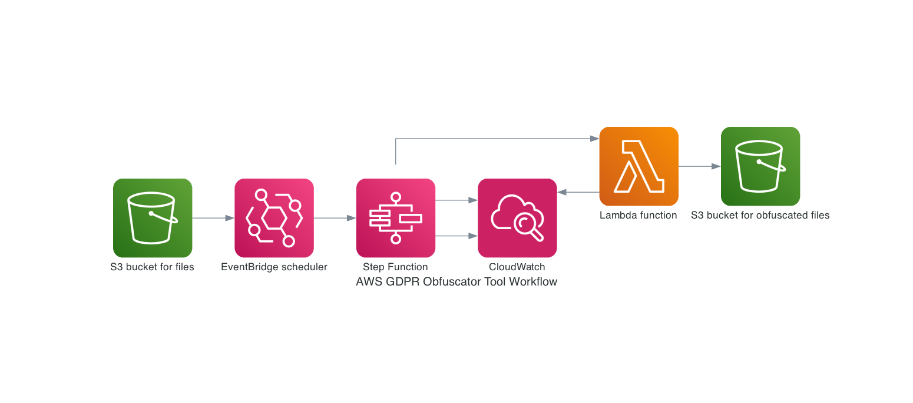
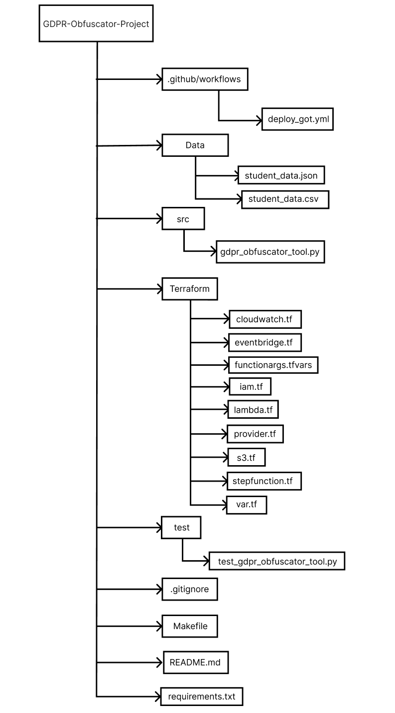

# GDPR-OBFUSCATOR-PROJECT
The overarching aim of this project was to create a general-purpose tool reengineered as a code-based module/package for intercepting personally identifiable information (PII). Taking cognisance of GDPR requirements, the GDPR obfuscator tool (GOT) serves to fully automate the process of masking or obfuscating values of personally identifiable fields in huge data sets.
The GOT module is primarily comprised of a GOT function with intrinsic behaviour of taking as an argument a json string comprising of the location of a file in an s3 (simple storage service) bucket in AWS (Amazon Web Service) and a list of fields containing GDPR sensitive data. This module is deployed in AWS and the automation of the provisioning of relevant cloud services was done using Terraform. Furthermore, a state machine (stepFunction) vis a vis an EventBridge scheduler was responsible for the invocation of the Lambda handler and, Github Actions was utilised for continuous integration and continuous development (CI/CD) of all facets of project implementation. Below are diagrams depiciting the project's worklow on AWS service and the project's file structure.

## Design Considerations and Requirements
The ensuing are design choices and performance criteria that are relevant to the implementation of this project:

-	The module should consist of a function that takes as an argument, a json string consisting of the s3 location (URI) of a csv or json file to be obfuscated, as well as a list of fields with sensitive information/data and. Also, this function should return a byte-stream representation of obfuscated data or a copy of the file with designated fields masked. Below, is an illustration of the function’s input argument and byte-stream representation of obfuscated data for a csv file.  
{
    "file_to_obfuscate": "s3://my_ingestion_bucket/new_data/file1.csv",  
    "pii_fields": ["name", email_address"]
}

    student_id,name,course,cohort,graduation_date,email_address
...
    
    1234,`***`,'Software','2024-03-31',`***`
...
-	The module or library must be compatible with most AWS infrastructure.
-	Bits of the code relating to file downloads and uploads should be preferably carried out using the AWS SDK for python (boto3).
-	Terraform Hashicorp language (HCL) was used as Infrastructure as Code (IaC).
-	The recording or versioning of credentials in code should be avoided due to potential security breaches.
-	It is assumed that the code obfuscates data one file per invocation.
-	Orchestration is done using StepFunctions and CI/CD utilising Github Actions.
-	Github secrets are used to hide credentials.
-	The module must be capable of processing csv or json files up to 1MB in size and this should be achieved in less than a minute.

## Operational Considerations and Procedures
These procedures serve as a guide to completing this project. Consequently, steps taken in this section can be repurposed and tailored to ones familiar to a developer.
- Open a VS code editor and create a csv or json file with dummy data, possessing fields such as id, name, course, cohort, graduation_date and email_address. This file must be up to 1MB in size; in the author’s case this was 13000 rows for csv files (1.1MB) and 7000 rows for json files (1.3MB). These dummy datasets were created using the third-party package, Faker; to install use  
~ pip install Faker
-	In Github, create a repo and initialise it with a README.md file. Click on the bright green code button and on the local tab copy the HTTPS web URL. Paste the URL in your VS code to clone the repo by using the “git clone <URL>” command in your CLI. A different account user should fork this repo before attempting to clone.
-	Create directories and files like the file structure above; again, certain aspects of this project are flexible, and it is up to the developer to employ methods and name styles they are most comfortable with.
-	Relative to the author’s design, Makefile commands were utilised in setting up the dev environment. Run “make create-environment” to create and activate a virtual environment as well as “make setupreq” to commence the downloading and installation of relevant packages and dependencies in the requirements.txt file.
-	Develop the obfuscating library with test driven development (TDD) using pytest. This is to verify the function’s behaviour is in accordance with desired outcomes.
-	Deploy AWS infrastructure using terraform. First, create a backend s3 bucket using the aws CLI or the AWS console. This bucket will serve as a “state bucket” for remote storage for storing and performing oversight functions for terraform state files.
-	Provision and configure your AWS provider with the backend state bucket.
-	Provision two (2) s3 buckets. One for storing output (obfuscated) files and the other for storing Lambda code.
-	Upload an s3 object (zip file) into the code bucket. This zip file will contain the Lambda code.
-	Provision AWS Lambda with the relevant parameters. Take care to select a “runtime” version with the python higher programming language. Also, choose an appropriate arn for a layer as applicable. In this case a custom AWS SDK pandas layer with a matching runtime version was selected; the pandas package was utilised for data transformation.
-	Setup AWS IAM roles and policies for AWS Lambda in this order. First, define an AWS IAM role for Lambda, then setup IAM policy documents to enable interaction between Lambda and the output s3 bucket, as well as relevant policy attachments indicating the policy’s role arn.
-	Using terraform create an AWS cloudwatch log group, cloudwatch log stream and, cloudwatch log metric filter. Likewise, setup SNS topic and SNS topic subscription for email alerts for situations of occurrence of an error while the Lambda handler is being executed. Furthermore, initiate a cloudwatch metric alarm, with parameters such as the threshold parameter, denoting the number of times and error needs to occur before an email alert can be sent.
-	Provision StepFunction and EventBridge scheduler for lambda handler invocation. For the EventBridge, make sure to use the library’s (function) argument as value for the input parameter. The keys of this json string value (which looks like a dictionary) should be declared as environment variables and their values stored as secrets in Github secrets.
-	Similarly, IAM roles and polices should be established for cloudwatch, StepFunction and EventBridge with comparable steps used for IAM roles and policies.
-	All parameters with connotations of credentials or sensitive materials/data should be declared as environment variables in terraform and their values saved as secrets in Github secrets. For example, AWS_ACCESS_KEY_ID, AWS_REGION, AWS_SECRET_ACCESS_KEY, FILE_TO_OBFUSCATE a host of other parameters. This is done by going to Github and clicking on your repo, followed by going to settings and on the left-hand pane clicking on secrets and variables and then on actions. In actions go on the secrets tab and click on new repository secrets to add secrets.
-	To use terraform, change directory to the directory that hosts the HCL files and run the following commands, terraform init, terraform plan and terraform apply. Run terraform destroy to destroy AWS infrastructure automatically.
-	Run the make dev-setup and make run-checks command to initiate checks such as PEP-8 compliance, tests coverage, unit testing, safety and security checks.
-	Implement a CI/CD pipeline by populating the YAML file located in the github/workflows directory.  
Additional information can be found in the repository’s directories and files.

### Project Graphs
This section presents project visuals in the form of graphs, information and a table indicating successful outcomes with invocation of the code-based library.  
Below is a simple graph depicting a successful run of the Got Lambda Invoke using StepFunctions.

Next is a collection of test information and a table illustrating test coverage checks.

Finally, is a graph portraying a CI/CD pipeline indicating a successful deployment of the GOT library.

In conclusion, on average it takes 30 seconds for the process of invocation to obfuscating and outputting the desired file to a pre-determined s3 bucket to complete. Test coverage was at 81%, with testing carried out on all salient behaviours of the library. There were no high or major vulnerabilities with the code and the library is PEP-8 compliant.